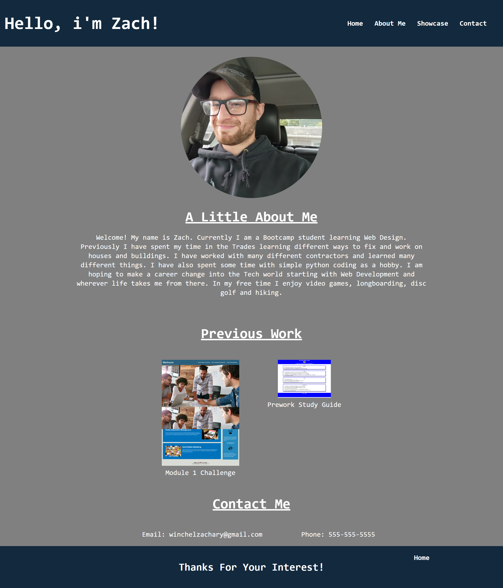

# Zach's Portfolio

## Intro
    
Thank you for visitin my Portfolio page! In this page you will find a few   different sections including a little bit about myself and my journey thus far. As well as a section including some previous work i've done up until this point, also different ways to get ahold of me if needed.

## Technologies
-HTML
-CSS

## Links to previous work

- Link to Pre-Work Study Guide

    https://zjw1239.github.io/prework-study-guide/

- Link to Challenge 1 launch page

    https://zjw1239.github.io/code-refactor/

## Sources
- https://medium.com/@ianjsikes/build-a-personal-website-with-html-and-css-part-1-3013fb5dacd4
    
    - Used the above link for a starter HTML layout, changed what I needed to for a customized layout and wording.
    
- CSS reset pulled from course material

- Media Queries were pulled and used from course material

- A tutor session helped me with some styling techniques and different ways of doing what i needed my portfolio to do and look the way i wanted.

## Outro
Thank you again for taking the time to look at and read through my portfolio page! I appreciate your time and patience as I am just learning the basics of Web Development. This portfolio will change and update as I learn more throughout the course.

## Screenshot of launched page

## Link to launched portfolio

https://zjw1239.github.io/my-portfolio/
